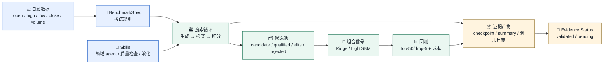
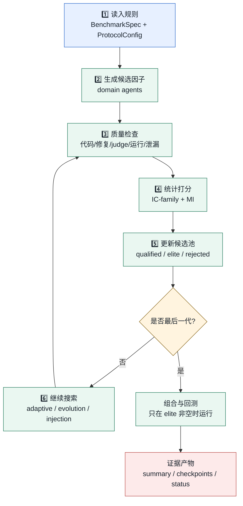

<!-- generated-by: gsd-doc-writer -->
# CogAlpha


> 面向量化研究的 **alpha 因子生成、质量检查、历史回测和证据管理** 平台。

**一句话**：CogAlpha 不把 LLM 写出的 alpha 直接当成结论；它把候选因子放进固定数据、固定标签、固定回测规则和可复现 artifact 里检验。

如果你第一次接触量化，可以先把 CogAlpha 想成一个“自动出题、自动批改、再回放历史表现”的实验系统：

| 类比 | 在 CogAlpha 里是什么 |
|---|---|
| 🧑‍🔬 研究员提出想法 | 多个领域 agent 根据 OHLCV 数据生成 alpha 因子；完整配置包含 21 个领域视角 |
| 📝 一道题的答案 | 一段 Python 函数：输入股票日线数据，输出一个股票打分序列 |
| ✅ 批改答案 | 代码质量、运行稳定性、时间泄漏、5 个统计指标检查 |
| 🧪 历史回放 | 用 top-50/drop-5 规则模拟每天买哪些股票、扣多少交易成本、收益如何 |
| 🧾 实验证据 | run summary、checkpoint、调用日志、evidence status |

CogAlpha 的核心目标不是“直接宣称发现了好 alpha”，而是先把每一次实验的规则、数据、结果和限制都记录清楚。只有当证据真的支持时，才把某个能力写成已验证；还在进行中的内容会明确标为 pending。



<sub>🟦 输入与规则 ｜ 🟩 运行时链路 ｜ 🟨 证据状态</sub>

---

## 目录

- [先看结论](#先看结论)
- [核心概念](#核心概念)
- [快速开始](#快速开始)
- [系统流程](#系统流程)
- [当前状态与范围](#当前状态与范围)
- [安装与环境](#安装与环境)
- [数据与 benchmark](#数据与-benchmark)
- [运行命令](#运行命令)
- [产物结构](#产物结构)
- [仓库内容与本地内容](#仓库内容与本地内容)
- [常见困惑](#常见困惑)
- [项目结构](#项目结构)
- [延伸阅读](#延伸阅读)

---

## 先看结论

| 你关心的问题 | 当前答案 |
|---|---|
| 🧭 这个项目在做什么？ | 用多 agent 生成股票 alpha 因子，并用严格 benchmark 与 artifact 证明运行结果。 |
| 🧪 现在能跑吗？ | 能。`scripts/run.py` 支持 dry-run；真实 LLM 模式需要先在本地准备数据和 API key。 |
| 📈 已经证明 alpha 有效了吗？ | 还没有。当前公开仓库只说明 runtime、benchmark 和数据准备方式，不把 alpha 表现作为结论。 |
| ✅ 当前完成了什么？ | 已有 paper-style 多代搜索 loop、质量检查、fitness gate、组合信号接口、top-50/drop-5 回测工具。 |
| 🚧 下一步是什么？ | 在完整数据、成本模型和运行设置下做更高规模验证，并用可复现 artifact 判断是否形成有效组合回测。 |
| 📦 仓库包含数据吗？ | 不包含真实市场数据；`data/` 只是空占位目录，数据需要按本文说明在本地生成。 |

### 公开 release 的定位

| 这个仓库是 | 这个仓库不是 |
|---|---|
| ✅ 一个 benchmark-first research runtime | ❌ 一个已经公开证明 alpha 有效的结果仓库 |
| ✅ 一个可读、可运行、可审计的工程入口 | ❌ 一个包含真实市场数据和私有运行日志的数据包 |
| ✅ 一个说明如何准备 Qlib 数据和运行回测的指南 | ❌ 一个替代数据授权、数据清洗和本地密钥管理的托管服务 |
| ✅ 一个把 CogAlpha / QuantaAlpha 设置分开记录的 benchmark harness | ❌ 一个可以混用不同论文设置后直接比较数字的排行榜 |

### 新读者路线

| 如果你想做什么 | 建议先看 |
|---|---|
| 只想知道项目是否适合你 | [先看结论](#先看结论) 与 [公开 release 的定位](#公开-release-的定位) |
| 想先了解基本概念 | [核心概念](#核心概念) 和 [系统 Walkthrough](docs/system-walkthrough.md) |
| 先确认环境能跑 | [快速开始](#快速开始) 与 [Dry-run](#-dry-run不花钱验证流程) |
| 准备真实数据 | [数据与 Benchmark](#数据与-benchmark) 与 [准备 Direct-Qlib 数据](#准备-direct-qlib-数据) |
| 判断结果能不能相信 | [产物结构](#产物结构) 与 [仓库内容与本地内容](#仓库内容与本地内容) |

---

## 核心概念

### 用白话解释

| 图标 | 概念 | 白话解释 | 项目里的名字 |
|---|---|---|---|
| 📈 | OHLCV | 股票每天的开盘价、最高价、最低价、收盘价、成交量 | `open/high/low/close/volume` |
| 🧮 | Alpha 因子 | 给股票打分的公式；分数越高，系统越倾向认为它未来可能表现更好 | `AlphaFunction` |
| 📜 | Benchmark | 一套考试规则：用哪个市场、哪段时间、标签怎么算、组合怎么买、成本怎么算 | `BenchmarkSpec` |
| 🧠 | Agent skill | 一个带领域偏好的 prompt 文件，负责生成或检查 alpha 因子 | `skills/*/SKILL.md` |
| 🏭 | Orchestrator | 不让 LLM 控制流程的确定性外循环 | `cogalpha/orchestrator.py` |
| 🗂️ | Candidate pool | 候选因子的不同状态列表 | `candidate/qualified/parent/elite/rejected` |
| 🧪 | Fitness | 用历史数据给 alpha 做统计检验 | IC / RankIC / ICIR / RankICIR / MI |
| 📊 | Backtest | 用历史数据模拟“如果当时按这个信号交易，会发生什么” | top-50/drop-5 portfolio backtest |
| 🧾 | Evidence status | 明确哪些结果已经验证、哪些仍在进行中 | README / walkthrough |

### 项目不变量

| 原则 | 为什么重要 |
|---|---|
| 📌 先 benchmark，后声明能力 | 没有固定考试规则，就无法比较不同实验。 |
| 📌 OHLCV-only 优先 | 新闻、公告、文本等信息源更容易泄漏未来信息，必须另做控制。 |
| 📌 CogAlpha 和 QuantaAlpha 设置分开 | 两篇/两套系统的时间窗、标签、评估规则不同，不能混成一个 benchmark。 |
| 📌 LLM 只在 skill 内工作 | 流程控制、重试、池更新、checkpoint、证据写入由 Python harness 决定。 |
| 📌 不可信 factor code 必须隔离执行 | LLM 生成的是 Python 代码，live path 必须用子进程和 timeout 控制风险。 |
| 📌 未验证不写成结论 | 没有可复现 backtest evidence，就不声称 alpha quality。 |

### 为什么不是“让 LLM 自己判断 alpha 好不好”

| 只让 LLM 自评会缺什么 | CogAlpha 的处理方式 |
|---|---|
| 没有固定数据和时间切分 | 用 `BenchmarkSpec` 固定 universe、split、label、成本和指标。 |
| 容易忽略未来函数 | 在质量门里加入代码检查、运行检查和 temporal leakage guard。 |
| 难以复核一次运行 | 写出 summary、checkpoint、调用摘要和数据 provenance。 |
| 容易把“看起来合理”当成“有效” | 只有形成组合信号和回测 artifact 后才讨论表现。 |

---

## 快速开始

### 1. 安装依赖

```bash
uv sync --python 3.12 --extra dev
```

### 2. 跑一次不花钱的 dry-run

```bash
uv run --python 3.12 --extra dev python scripts/run.py
```

你会看到类似：

```text
completed 6 / 6
```

同时会写出：

```text
outputs/runs/dry-run/run-summary.json
outputs/checkpoints/gen-*.json
```

### 3. 查看命令入口

```bash
uv run --python 3.12 --extra dev python scripts/run.py --help
```

### 4. 理解当前项目状态

公开 release 不携带历史 `outputs/` 产物。请把它理解成一个可运行的 benchmark runtime：你可以先做 dry-run，准备数据和 API key 后再生成自己的真实运行 artifact。

README 只保留对新读者最重要的状态：

| 领域 | 当前状态 |
|---|---|
| Runtime loop | 可用 dry-run 做本地 smoke check |
| Full-scale paper run | 需要完整数据、运行设置和 artifact 后才能形成公开结论 |
| Alpha performance | 尚未声明有效 |
| Data | 需本地准备，不随 git 发布 |
| Secrets / raw model I/O | 不包含在仓库中 |

详细运行案例见 [system walkthrough](docs/system-walkthrough.md)。

---

## 系统流程

CogAlpha 的主运行链路可以拆成 6 步：



| 步骤 | 做什么 | 代码位置 | 新人需要理解的点 |
|---|---|---|---|
| 1️⃣ 规则 | 固定实验怎么评估 | `cogalpha/benchmark/`, `cogalpha/protocol.py` | 没有规则就没有公平比较。 |
| 2️⃣ 生成 | 让领域 agent 写 factor 函数 | `cogalpha/stages/generation.py`, `skills/` | 每个 factor 本质是一段 Python 函数。 |
| 3️⃣ 检查 | 过滤坏代码和泄漏未来的代码 | `cogalpha/stages/quality.py`, `cogalpha/guards/` | 股票实验最怕“偷看未来”。 |
| 4️⃣ 打分 | 在历史数据上算预测统计量 | `cogalpha/stages/fitness.py`, `cogalpha/evaluation.py` | 统计显著不等于一定赚钱，但能筛掉明显弱因子。 |
| 5️⃣ 分池 | 把候选放入不同状态池 | `cogalpha/state.py` | `elite_pool` 非空才有后续组合回测的原料。 |
| 6️⃣ 搜索 | 根据好/坏案例继续生成或演化 | `cogalpha/stages/adaptive.py`, `evolution.py`, `injection.py` | 这是多代搜索，不是一次性生成。 |

---

## 当前状态与范围

### Project Milestones

| 阶段 | 状态 | 读者可理解的结论 |
|---|---|---|
| Benchmark-first foundation | completed | 建立 OHLCV benchmark、spec diff、validation 和 top-k/dropout backtest 基础。 |
| Architecture cleanup | completed | 梳理 runtime/validation 边界，形成更可维护的工程结构。 |
| Data and guard scaffold | completed | 接入 Direct-Qlib 数据准备、guard、metric parity 和 preflight。 |
| Paper-style MAS runtime | completed | 重建多代搜索 loop、质量检查、fitness gate 和 artifact 接口。 |
| Scale validation roadmap | in progress | 更高规模运行需要完整数据、运行设置和可复现 artifact 支持。 |

### Public Status

| Area | Status | Notes |
|---|---|---|
| Runtime engine | Available | `scripts/run.py` 可执行 dry-run；真实 LLM 模式需要本地数据和 API key。 |
| Benchmark contract | Available | CogAlpha / QuantaAlpha 设置分开记录，避免混用时间窗和 label。 |
| Data | Bring your own | 仓库只保留空 `data/` 目录；见 [数据与 Benchmark](#数据与-benchmark)。 |
| Full paper-scale run | Pending | 需要按完整设置生成可复现 artifact 后才能讨论。 |
| Alpha effectiveness | Not established | 需要 converged run、组合信号和回测指标后才能讨论。 |
| Raw prompts / model output | Not included | 公开仓库只保留代码和文档，不包含原始模型 I/O。 |

---

## 安装与环境

| 类型 | 要求 |
|---|---|
| 🐍 Python | `.python-version` 为 `3.12`；包声明要求 `>=3.11` |
| 📦 包管理 | 推荐 `uv`，仓库带 `uv.lock` |
| 🧪 验证 | runtime release 可用 `scripts/run.py --help` 和 dry-run 做 smoke check；完整测试套件不随 release 分发 |
| 🧮 数值依赖 | `numpy`, `pandas`, `scipy`, `scikit-learn`, `lightgbm`, `ta-lib` |
| 📈 数据依赖 | Direct-Qlib 路径可选 `pyqlib` extra |
| 🧠 LLM | DeepSeek/OpenAI-compatible API，仅真实 LLM 模式需要 |

安装：

```bash
uv sync --python 3.12 --extra dev
```

如果要准备 Direct-Qlib 数据：

```bash
uv sync --python 3.12 --extra dev --extra qlib
```

真实 LLM 模式需要先在本地 shell 设置 `COGALPHA_LLM_API_KEY`。不要把真实值写入 README、artifact 或 git commit。

可选配置：

| 环境变量 | 默认 / 来源 | 用途 |
|---|---|---|
| `COGALPHA_LLM_API_KEY` | 必填 | 真实 LLM API key |
| `COGALPHA_LLM_BASE_URL` | DeepSeek 默认 `https://api.deepseek.com` | OpenAI-compatible endpoint |
| `COGALPHA_LLM_MODEL` | `deepseek-v4-flash` | 模型名 |
| `COGALPHA_LLM_REASONING_EFFORT` | `max` | 推理强度 |
| `COGALPHA_LLM_THINKING` | `enabled` | DeepSeek thinking 开关 |
| `COGALPHA_LLM_MAX_TOKENS` | 未设置 | 最大输出 token |

---

## 数据与 Benchmark

### 发布分支为什么只有空 `data/`

runtime 发布分支只保留一个空的 `data/` 占位目录。真实市场数据不进入 git：

| 原因 | 解释 |
|---|---|
| 📦 文件太大 | parquet/HDF5 市场数据很容易超过 GitHub 普通文件限制。 |
| 🔁 数据应可再生成 | benchmark 证据依赖数据来源、版本、split 和 label 定义，而不是依赖一次手工拷贝。 |
| 🔒 避免误公开 | 本地数据可能包含供应商路径、缓存痕迹或不可再分发内容。 |
| 🧾 保留可审计契约 | README 写清楚目录结构和生成命令，数据由使用者在本地准备。 |

发布分支预期目录形态：

```text
data/
└── .gitkeep              # 只用于让空目录进入 git
```

准备数据后，本地会变成：

```text
data/
└── processed/
    ├── direct_qlib_csi300/
    │   ├── metadata.json
    │   ├── ohlcv_panel.parquet
    │   ├── benchmark_returns.parquet
    │   ├── calendar.json
    │   ├── instruments.json
    │   ├── train_ohlcv.parquet
    │   ├── valid_ohlcv.parquet
    │   ├── test_ohlcv.parquet
    │   ├── train_forward_returns.parquet
    │   ├── valid_forward_returns.parquet
    │   └── test_forward_returns.parquet
    └── direct_qlib_csi300_u100/
        └── ...           # 可选 reduced scope，用于低成本真实验证
```

> `data/processed/**` 是本地运行输入，不是发布分支的一部分。

### 为什么先讲 benchmark？

量化实验很容易“看起来很厉害但不可比较”。CogAlpha 用 `BenchmarkSpec` 先固定考试规则：

| 问题 | BenchmarkSpec 负责回答 |
|---|---|
| 📍 用哪个市场？ | CSI300 |
| 🕒 用哪段时间？ | data window + train/valid/test split |
| 🎯 预测什么？ | 10-day next-open forward return |
| 💰 怎么交易？ | open price execution，signal-to-trade delay |
| 🧺 怎么组合买股票？ | top-50/drop-5 |
| 🧾 成本怎么算？ | open/close cost + min cost |
| 📊 指标怎么算？ | IC-family、AER、IR、MDD、turnover、cost drag |

### 已有 preset

| Preset | 用途 | 重要区别 |
|---|---|---|
| `cogalpha_csi300_ohlcv_v1` | CogAlpha-first CSI300 OHLCV target | 10-day next-open label，2011→2024 paper setting |
| `quantaalpha_csi300_ohlcv_v1` | QuantaAlpha public-config comparison reference | next-day close expression，2016→2025 config setting |

读取方式：

```python
from cogalpha.benchmark import get_benchmark_spec

spec = get_benchmark_spec("cogalpha_csi300_ohlcv_v1")
snapshot = spec.model_dump(mode="json")
```

### Qlib 是什么

Qlib 可以理解成一个“量化研究的数据和实验工具箱”。在 CogAlpha 里，Qlib 的角色很窄：

| Qlib 负责 | CogAlpha 自己负责 |
|---|---|
| 📥 读取本地 provider_uri 下的行情、日历、成分股和基准价格 | 🧠 生成 alpha 因子 |
| 📈 提供 `$open/$high/$low/$close/$volume` 等字段 | ✅ 检查因子代码和时间泄漏 |
| 🧭 提供 CSI300 instrument universe 和 trading calendar | 🧪 计算 IC-family、训练组合信号、执行 top-50/drop-5 回测 |
| 🧾 帮助形成 source manifest 和 data provenance | 🧾 写出 run summary、checkpoint 和 evidence status |

重要边界：

| 边界 | 说明 |
|---|---|
| Qlib 是数据来源，不是本项目的回测裁判 | `cogalpha/backtest.py` 自己实现组合构造、成本和收益统计。 |
| Qlib 字段名会被标准化 | `$open` → `open`，`$high` → `high`，`$low` → `low`，`$close` → `close`，`$volume` → `volume`。 |
| Qlib index 会被标准化 | `datetime/instrument` → `date/ticker`。 |
| Qlib parity 不作为默认结论 | README 只说明 backtest-readiness；不声称与 Qlib 官方回测完全等价。 |

### 安装 Qlib 依赖

`pyqlib` 当前只在 Python `<3.13` 的 extra 中启用；本项目推荐使用 `.python-version` 中的 Python 3.12：

```bash
uv sync --python 3.12 --extra dev --extra qlib
```

如果只想读 README、跑 dry-run 或查看 CLI，不需要安装 Qlib：

```bash
uv sync --python 3.12 --extra dev
```

### 准备 Direct-Qlib 数据

先准备一个本地 Qlib provider directory，例如：

```text
~/.qlib/qlib_data/cn_data/
```

它需要能被 Qlib 读取，并包含：

| 输入 | 为什么需要 |
|---|---|
| CSI300 instruments | 知道每天哪些股票属于目标 universe。 |
| trading calendar | 按交易日而不是自然日切分。 |
| `$open/$high/$low/$close/$volume` | 因子输入只允许 OHLCV。 |
| `SH000300` open price | 生成 benchmark open-to-open returns。 |

生成主数据：

```bash
uv run --python 3.12 --extra dev --extra qlib python scripts/prepare_direct_qlib_csi300.py \
  --provider-uri ~/.qlib/qlib_data/cn_data \
  --market csi300 \
  --benchmark-symbol SH000300 \
  --output-dir data/processed/direct_qlib_csi300 \
  --start-date 2011-01-01 \
  --end-date 2024-12-01 \
  --strict
```

只探测环境、不导出表：

```bash
uv run --python 3.12 --extra dev --extra qlib python scripts/prepare_direct_qlib_csi300.py \
  --provider-uri ~/.qlib/qlib_data/cn_data \
  --probe-only \
  --allow-blocker
```

如果你没有 Qlib provider，命令会 fail closed，并把缺失项写成 blocker，而不是假装数据已经准备好。

上面这一步导出的是合并行情和 source evidence。真实 runner 还需要 `train/valid/test` split 和 forward-return label，可以用项目内的数据函数生成：

```bash
uv run --python 3.12 --extra dev python - <<'PY'
import hashlib
import json
from datetime import UTC, datetime
from pathlib import Path

import pandas as pd

from cogalpha.config import BaselineExperimentConfig
from cogalpha.data import build_baseline_market_data, normalize_ohlcv_panel

root = Path("data/processed/direct_qlib_csi300")
panel = normalize_ohlcv_panel(pd.read_parquet(root / "ohlcv_panel.parquet"))
config = BaselineExperimentConfig()
market = build_baseline_market_data(panel, config)

for split_name in ("train", "valid", "test"):
    split = market.split(split_name)
    split.ohlcv_panel.reset_index().to_parquet(root / f"{split_name}_ohlcv.parquet", index=False)
    split.forward_returns.to_parquet(root / f"{split_name}_forward_returns.parquet")

payload = {
    "data_source": "direct_qlib",
    "dataset": config.dataset,
    "horizon_days": config.horizon_days,
    "return_price_column": config.return_price_column,
    "trade_delay_days": config.trade_delay_days,
    "split": config.split.model_dump(mode="json"),
    "rows": int(len(panel)),
    "assets": int(panel.index.get_level_values("ticker").nunique()),
    "dates": int(panel.index.get_level_values("date").nunique()),
    "prepared_at": datetime.now(UTC).isoformat(),
}
payload["data_version"] = hashlib.sha256(
    json.dumps(payload, sort_keys=True).encode("utf-8")
).hexdigest()
(root / "metadata.json").write_text(json.dumps(payload, indent=2, sort_keys=True), encoding="utf-8")
print(json.dumps(payload, indent=2, sort_keys=True))
PY
```

如果你要做低成本验证，可以在本地另建 `data/processed/direct_qlib_csi300_u100/`，保留至少 80 支股票；低于这个数量会破坏 top-50/drop-5 的横截面充分性。

### 数据文件契约

CogAlpha 期望每个 prepared dataset 至少有这些文件：

| 文件 | 形状 | 用途 |
|---|---|---|
| `metadata.json` | JSON | 数据来源、版本、split、label、生成参数。 |
| `ohlcv_panel.parquet` | long panel | 全量 `(date, ticker)` OHLCV。 |
| `train_ohlcv.parquet` | long panel | 训练 split 的 OHLCV。 |
| `valid_ohlcv.parquet` | long panel | 验证 split 的 OHLCV。 |
| `test_ohlcv.parquet` | long panel | 测试 split 的 OHLCV。 |
| `train_forward_returns.parquet` | date × ticker | 训练标签。 |
| `valid_forward_returns.parquet` | date × ticker | 验证标签。 |
| `test_forward_returns.parquet` | date × ticker | 测试标签。 |
| `benchmark_returns.parquet` | date → return | 可选但推荐，用于 excess return / IR。 |

OHLCV panel 的最低要求：

| 字段 | 要求 |
|---|---|
| index | two-level MultiIndex：`date`, `ticker`；或平铺列中有 `date` / `asset` 可被标准化。 |
| `date` | 可被 `pandas.to_datetime` 解析。 |
| `ticker` | 非空字符串；同一天同一股票不能重复。 |
| columns | 必须包含 `open`, `high`, `low`, `close`, `volume`。 |
| value | 必须可转成数值；允许少量缺失，但质量门会限制 NaN。 |
| order | 按 `date, ticker` 排序。 |

forward-return label 的生成逻辑：

| 字段 | CogAlpha preset |
|---|---|
| price column | `open` |
| trade delay | 1 trading day |
| horizon | 10 trading observations |
| expression | `future_open[t+1+10] / future_open[t+1] - 1` |
| 含义 | 今天收盘后形成信号，下一次开盘进场，持有约 10 个交易日。 |

### 数据校验清单

准备完数据后，建议先检查：

```bash
python -m json.tool data/processed/direct_qlib_csi300/metadata.json
```

再用 Python 快速读表：

```bash
uv run --python 3.12 --extra dev python - <<'PY'
import pandas as pd
from cogalpha.data import normalize_ohlcv_panel

root = "data/processed/direct_qlib_csi300"
panel = normalize_ohlcv_panel(pd.read_parquet(f"{root}/ohlcv_panel.parquet"))
print("rows:", len(panel))
print("dates:", panel.index.get_level_values("date").nunique())
print("assets:", panel.index.get_level_values("ticker").nunique())
print("columns:", list(panel.columns))
PY
```

### Backtest 怎么做

CogAlpha 的回测不是“直接问 Qlib 结果是多少”，而是按 `BenchmarkSpec` 在 `cogalpha/backtest.py` 中重做一套可审计计算。

```mermaid
flowchart LR
    SIG["因子/组合信号<br/>date × ticker"] --> ALIGN["对齐 OHLCV<br/>只保留共同日期和股票"]
    ALIGN --> RANK["每天按分数排序"]
    RANK --> HOLD["top-50/drop-5<br/>等权持仓"]
    HOLD --> TRADE["计算换仓<br/>buy/sell + cost"]
    TRADE --> RET["open-to-open 收益<br/>gross - cost"]
    RET --> MET["指标<br/>AER / IR / MDD / turnover"]

    classDef input fill:#e7f0ff,stroke:#2764c8,color:#17202a;
    classDef work fill:#eaf7f1,stroke:#20785a,color:#17202a;
    classDef out fill:#fff4df,stroke:#8a681c,color:#17202a;
    class SIG input;
    class ALIGN,RANK,HOLD,TRADE,RET work;
    class MET out;
```



回测步骤：

| 步骤 | 代码函数 | 白话解释 |
|---|---|---|
| 1️⃣ signal alignment | `align_signals_to_ohlcv` | 信号和行情只保留共同的日期、股票。 |
| 2️⃣ portfolio construction | `construct_topk_dropout_portfolio` | 每天选信号最高的 `topk=50`，并按 `n_drop=5` 控制换仓。 |
| 3️⃣ trade/cost ledger | `compute_trades_and_costs` | 根据目标持仓变化生成买卖、turnover 和交易成本。 |
| 4️⃣ return series | `compute_portfolio_return_series` | 用 open-to-open asset return 算 gross return，再扣 cost。 |
| 5️⃣ metrics | `compute_portfolio_metrics` | 输出累计收益、年化收益、超额收益、IR、最大回撤、换手率和成本拖累。 |

默认成本模型：

| 成本 | 值 | 含义 |
|---|---:|---|
| open cost | 0.0005 | 买入费率 |
| close cost | 0.0015 | 卖出费率 |
| min cost | 5 CNY | 单笔最低费用 |
| initial capital | 1,000,000 CNY | 成本折算基准 |

指标读法：

| 指标 | 解释 |
|---|---|
| cumulative return | 回测期间净值总涨跌。 |
| annualized return | 按 252 个交易日年化后的收益。 |
| annualized excess return | 相对 benchmark 的年化超额收益。 |
| information ratio | `mean(excess) / std(excess) * sqrt(252)`，沿用 Qlib 风格年化。 |
| max drawdown | 从历史高点到低点的最大回撤。 |
| mean turnover | 平均换手，越高通常成本越敏感。 |
| total transaction cost return | 总交易成本折算成收益率后的拖累。 |

最小示例：

```python
import pandas as pd

from cogalpha.backtest import run_portfolio_backtest
from cogalpha.benchmark import get_benchmark_spec
from cogalpha.data import normalize_ohlcv_panel

spec = get_benchmark_spec("cogalpha_csi300_ohlcv_v1")
root = "data/processed/direct_qlib_csi300"

ohlcv = normalize_ohlcv_panel(pd.read_parquet(f"{root}/test_ohlcv.parquet"))
benchmark = pd.read_parquet(f"{root}/benchmark_returns.parquet").squeeze("columns")

# signals 是一个 date × ticker DataFrame；真实运行中它来自 elite factors 的组合信号。
signals = pd.read_parquet("my_signals.parquet")

result = run_portfolio_backtest(
    signals,
    ohlcv,
    spec,
    benchmark_returns=benchmark,
)

print(result.metrics.model_dump())
print(result.trade_ledger.cost_summary.model_dump())
```

如果当前运行没有形成可用组合信号，系统不会伪造回测结果；这类情况会在 run summary 中明确记录。

---

## 运行命令

### 🧪 Dry-run：不花钱验证流程

```bash
uv run --python 3.12 --extra dev python scripts/run.py \
  --output-root outputs/runs \
  --run-id dry-run \
  --checkpoint-dir outputs/checkpoints
```

默认 dry-run profile：

| 字段 | 值 |
|---|---:|
| domain agents | 2 |
| initial / parent / children pool | 4 / 2 / 6 |
| generations | 6 |
| inner subcycles × length | 2 × 3 |
| benchmark preset | `cogalpha_csi300_ohlcv_v1` |

### 🧠 Real validation：真实 LLM + reduced data

真实 LLM 模式不会自动下载或生成数据。先按 [准备 Direct-Qlib 数据](#准备-direct-qlib-数据) 生成 `data/processed/direct_qlib_csi300/`，再设置 `COGALPHA_LLM_API_KEY` 后运行：

```bash
uv run --python 3.12 --extra dev python scripts/run.py \
  --real \
  --data-dir data/processed/direct_qlib_csi300 \
  --output-root outputs/runs \
  --run-id my-real-validation \
  --checkpoint-dir outputs/checkpoints/my-real-validation \
  --max-invocations 261 \
  --concurrency 20
```

示例 validation profile：

| 字段 | 值 |
|---|---:|
| domain agents | 6 |
| initial / parent / children pool | 24 / 8 / 24 |
| generations | 6 |
| factors per request | 4 |
| injection cadence | every 2 generations |

### 📜 Paper-default：完整目标系统规模

`ProtocolConfig.paper_default()` 锁定：

| 字段 | 值 |
|---|---:|
| domain agents | 21 |
| initial / parent / children pool | 80 / 32 / 96 |
| generations | 24 |
| inner subcycles × length | 3 × 8 |
| factors per request | 4 |
| injection cadence | every 2 generations |
| elite carry | 2 |
| qualified / elite percentile | 0.65 / 0.80 |
| NaN reject threshold | 0.30 |

---

## 产物结构

一次 run 会产生两类核心产物：

```text
outputs/runs/<run_id>/
├── run-summary.json          # 本次运行状态、池大小、组合信号、回测摘要
├── skill_invocations.jsonl   # 脱敏后的 skill 调用记录
└── model_io/                 # 启用 recorder 时的脱敏 prompt/output 指纹与文件

outputs/checkpoints/<run_id>/
├── gen-0.json
├── gen-1.json
├── ...
└── gen-<g>.json              # 每代 state + run identity
```

`run-summary.json` 的形状类似：

```json
{
  "run": {
    "status": "completed | partial | interrupted",
    "generations_completed": 0,
    "generations_target": 0,
    "final_pool_sizes": {
      "store": 0,
      "candidate": 0,
      "qualified": 0,
      "parent": 0,
      "elite": 0,
      "rejected": 0
    }
  },
  "combined_signal": null,
  "backtest": null
}
```

### 怎么读这个结果？

| 字段 | 白话解释 |
|---|---|
| `status` | 搜索循环是否完成，或是否因为预算、中断等原因提前停止。 |
| `final_pool_sizes` | 最后每个候选池里有多少候选。 |
| `combined_signal` | 是否训练出了组合信号。 |
| `backtest` | 是否产生了组合回测指标。 |

---

## 仓库内容与本地内容

这个发布分支面向第一次接触项目的读者，保留的是可公开、可复现、可运行的 runtime 入口。真实运行时产生的本地材料需要单独管理。

| 仓库中包含 | 本地自行准备或保存 |
|---|---|
| ✅ runtime 代码、README、walkthrough、benchmark spec、smoke 命令 | `COGALPHA_LLM_API_KEY`、`KEY.md` 或其他本地密钥文件 |
| ✅ 数据准备说明和文件契约 | 真实 Qlib provider、parquet 数据和本地缓存 |
| ✅ 可复现的运行入口 | 真实运行产生的 `outputs/`、checkpoint 和模型调用记录 |
| ✅ 当前状态说明 | 未脱敏 prompt/output、provider 原始响应和本地调试日志 |

### 公开文档写作边界

| 适合写进 README | 应保留在本地或脱敏 artifact 中 | 原因 |
|---|---|---|
| 项目目标、安装方式、运行命令、目录结构 | 个人协作记录、聊天上下文、内部指令 | README 面向第一次接触项目的人，不应依赖私人上下文。 |
| Benchmark preset、数据文件契约、指标定义 | 未授权再分发的市场原始数据 | 第三方需要知道如何复现，不需要拿到你的本地数据副本。 |
| 脱敏后的 artifact 形状和字段解释 | 完整模型输入、完整模型输出、provider 原始响应 | 原始模型 I/O 可能包含私有上下文、账号信息或不可公开材料。 |
| 已由 artifact 支撑的运行状态 | 没有 summary、manifest、metrics 支撑的 alpha 表现结论 | 量化结果必须能被数据版本、split、成本和指标定义复核。 |
| 安全边界和本地密钥设置方式 | API key、`.env`、`KEY.md`、shell history | 密钥和本地路径不属于公开 release。 |

如果需要分享某次真实 run，建议先做脱敏和范围审查，只保留：

```text
run-summary.json
必要的 redacted invocation 摘要
数据 provenance 与 split 信息
指标定义和 benchmark spec
```

不要把这些内容提交到 public git：

```text
KEY.md
未脱敏 model_io
含真实密钥的 shell history / notebook / debug log
本地笔记、聊天记录或账号路径
```

---

## 常见困惑

| 问题 | 答案 |
|---|---|
| 🤔 Alpha 因子是不是交易策略？ | 不是。因子只是给股票打分的信号；策略还包括怎么买、买多少、何时换仓、成本怎么算。 |
| 🤔 为什么当前不声明 alpha 有效？ | 因为还需要更高规模的 converged run、组合信号和可复现回测指标。 |
| 🤔 为什么有 dry-run 和 real run？ | dry-run 用来检查流程和接口，不花钱；real run 才调用 LLM 和真实数据。 |
| 🤔 为什么不直接宣称论文复现完成？ | 因为 full paper-scale run 和最终组合回测仍需要可复现 artifact 支持。 |
| 🤔 为什么要区分 CogAlpha 和 QuantaAlpha preset？ | 两套设置的日期、标签和评估规则不同，混用会造成不公平比较。 |
| 🤔 为什么只用 OHLCV？ | 这是最容易控制泄漏和复现的第一层数据；信息侧数据以后必须单独建泄漏控制。 |
| 🤔 这个项目安全吗？ | 生成代码的 live path 使用子进程隔离和 timeout；但真实 API key 和未脱敏模型 I/O 仍需谨慎管理。 |

---

## 项目结构

```text
.
├── cogalpha/
│   ├── benchmark/          # BenchmarkSpec / presets / diff / validation
│   ├── data_sources/       # Direct-Qlib source probes and manifests
│   ├── guards/             # static/runtime generated-code safety checks
│   ├── skill_runtime/      # skill loading, prompt rendering, output parsing
│   ├── stages/             # generation / quality / fitness / evolution / injection
│   ├── verification/       # trace verifier
│   ├── backtest.py         # top-50/drop-5 portfolio backtest
│   ├── combination.py      # rolling-126 Ridge / LightGBM combination signal
│   ├── orchestrator.py     # paper §2 deterministic loop
│   ├── protocol.py         # paper-default / validation ProtocolConfig
│   └── state.py            # central store + five candidate pools
├── skills/                 # 21 domain skills + quality/evolution skills
├── scripts/                # runtime command-line adapters
├── data/                   # empty placeholder in release; prepared datasets stay local
├── docs/                   # project docs and walkthrough
├── configs/                # baseline runtime configs
└── uv.lock                 # locked Python dependency graph
```

---

## 延伸阅读

📖 **[系统 Walkthrough：从数据到可复现回测](docs/system-walkthrough.md)**

这篇 walkthrough 用公开 release 的口径解释：

- 🏭 一次实验如何从数据和规则走到候选池；
- 📦 checkpoint、调用日志、run summary 分别应该证明什么；
- 🚧 为什么“跑通 runtime”和“alpha 有效”不是同一件事；
- 🧭 公开 artifact 需要记录哪些数据、规则和结果边界。

精简发布分支只保留 runtime 代码、空 `data/` 占位目录、README 和这篇 walkthrough；真实数据、密钥、临时输出和个人工作记录应保留在本地环境。
