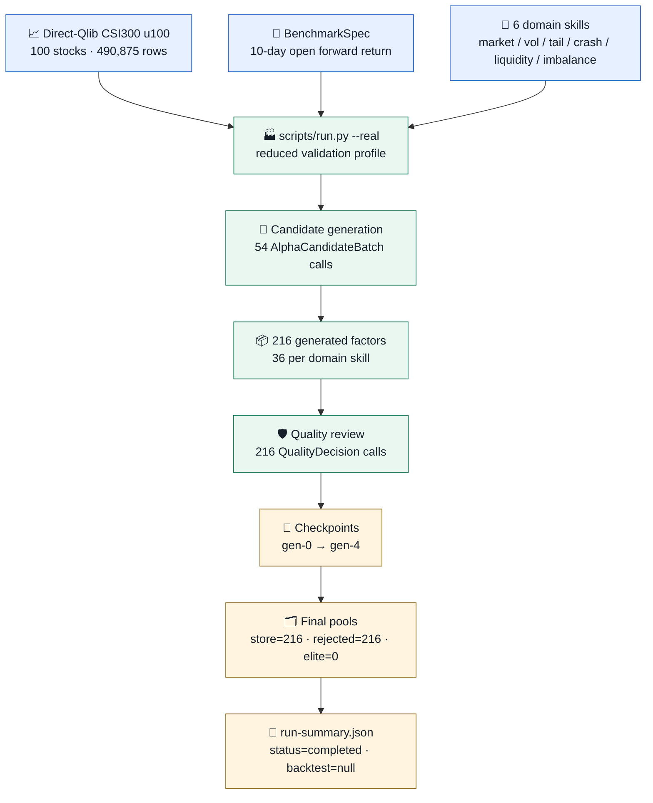
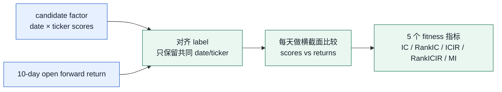
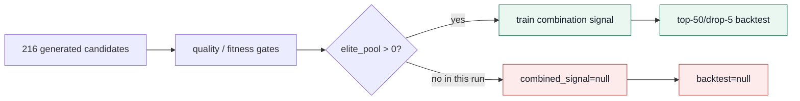
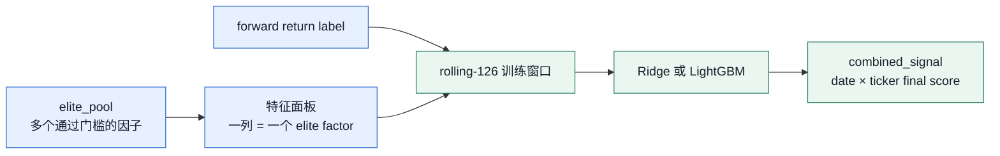
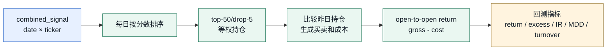

<!-- generated-by: gsd-doc-writer -->
# CogAlpha 系统案例详解：一次真实运行轨迹长什么样

本文跟踪一条已经完成的 **reduced real validation** 运行，展示 CogAlpha 从数据、agent 生成、质量检查、checkpoint 到 run summary 的完整轨迹。

这不是概念介绍，也不是 alpha 表现宣称。它回答的是更具体的问题：

> 一次 CogAlpha run 真正跑起来时，读了什么数据、调用了哪些 skill、生成了多少候选、产出了哪些文件、最后为什么没有回测。

本文使用的开发侧 artifact 路径如下。公开 release 不携带这些 `outputs/` 和真实数据文件；本文只摘录安全字段，方便读者理解系统形态。

```text
data/processed/direct_qlib_csi300_u100/metadata.json
outputs/runs/v4.0-validation/run-summary.json
outputs/runs/v4.0-validation/skill_invocations.jsonl
outputs/checkpoints/v4.0-validation/gen-0.json
outputs/checkpoints/v4.0-validation/gen-1.json
outputs/checkpoints/v4.0-validation/gen-2.json
outputs/checkpoints/v4.0-validation/gen-3.json
outputs/checkpoints/v4.0-validation/gen-4.json
```

为了安全，本文不包含 API key、`.env`、完整模型输入、完整模型输出、供应商原始响应、个人协作记录或真实市场数据文件。

---

## 0. 一眼看完整轨迹



<sub>🟦 输入与规则 ｜ 🟩 真实执行 ｜ 🟨 可复核 artifact</sub>

| 本次案例事实 | 值 |
|---|---:|
| run id | `v4.0-validation` |
| 数据来源 | `direct_qlib` |
| 股票数 | 100 |
| OHLCV 行数 | 490,875 |
| generation target | 6 |
| generation completed | 6 |
| skill invocations | 270 |
| invocation status | 270 `ok` |
| generated candidates | 216 |
| final `elite_pool` | 0 |
| `combined_signal` | `null` |
| `backtest` | `null` |

### 本文怎么读

| 章节 | 看什么 |
|---|---|
| [1. 数据进来](#1-数据进来) | 这条 run 使用什么市场数据和标签。 |
| [2. 运行配置](#2-运行配置) | 为什么是 6 个 agent、6 代、216 个候选。 |
| [3. 调用日志](#3-调用日志) | 每次 LLM skill 调用在 artifact 里长什么样。 |
| [4. 候选因子](#4-候选因子) | 真实生成的 factor code 是什么形态。 |
| [5. Checkpoint](#5-checkpoint) | 每一代候选池如何变化。 |
| [6. Summary](#6-summary) | 最终结果文件怎么读。 |
| [7. 证据边界](#7-证据边界) | 这条轨迹支持什么，不支持什么。 |

---

## 1. 数据进来

这条 run 使用的是 `direct_qlib_csi300_u100`，也就是从 CSI300 数据中选出 100 支股票的 reduced panel。它不是完整论文规模数据，但足够检查真实 LLM 调用、候选生成、质量门和 checkpoint 链路。

`metadata.json` 摘要：

| 字段 | 值 |
|---|---|
| `data_source` | `direct_qlib` |
| `dataset` | `CSI300` |
| `data_version` | `108a5c8490b66f532736cdbe6b986d7460f6d3b43e03fe6c3e0f36ac086e17d6` |
| `full_panel.assets` | 100 |
| `full_panel.rows` | 490,875 |
| `full_panel.start` → `end` | 1999-11-10 → 2020-09-25 |
| `return_price_column` | `open` |
| `trade_delay_days` | 1 |
| `horizon_days` | 10 |
| `label_lookahead_trading_days` | 11 |

训练、验证、测试切分：

| split | 日期范围 | rows | forward-return 非空数 |
|---|---|---:|---:|
| train | 2000-12-01 → 2012-11-13 | 280,684 | 269,239 |
| valid | 2012-11-14 → 2016-11-10 | 93,600 | 90,659 |
| test | 2016-11-11 → 2020-09-10 | 93,600 | 91,412 |

标签的白话解释：

> 今天形成股票打分；下一次开盘进场；观察之后约 10 个交易日的 open-to-open forward return。

这一步的关键不是“数据越大越好”，而是 artifact 记录了数据来源、股票范围、时间切分、标签定义和版本 hash。没有这些字段，后面的回测数字就无法复核。

---

## 2. 运行配置

这条 run 使用 real validation profile。它比 paper-default 小，但仍然走真实 LLM skill 调用和同一条 orchestrator 链路。

| 字段 | 本次 real validation |
|---|---:|
| domain agents | 6 |
| initial pool | 24 |
| parent pool | 8 |
| children pool | 24 |
| generations | 6 |
| inner subcycles × length | 2 × 3 |
| factors per request | 4 |
| injection cadence | every 2 generations |

6 个 domain skills：

| skill | 候选数 | 研究视角 |
|---|---:|---|
| `alpha-market-cycle` | 36 | 市场周期、阶段变化 |
| `alpha-volatility-regime` | 36 | 波动率状态 |
| `alpha-tail-risk` | 36 | 尾部风险 |
| `alpha-crash-predictor` | 36 | 崩盘前兆 |
| `alpha-liquidity` | 36 | 流动性和冲击成本 |
| `alpha-order-imbalance` | 36 | 买卖压力 |

为什么每个 skill 是 36 个候选？

| 来源 | 数量 |
|---|---:|
| `AlphaCandidateBatch` 调用总数 | 54 |
| domain skill 数量 | 6 |
| 每个 skill batch 数 | 9 |
| 每个 batch factors | 4 |
| 每个 skill candidates | 36 |
| 总 candidates | 216 |

可以把这一步理解成：6 个不同研究视角的 agent，各自多次提出 alpha 函数，系统把这些候选统一放入候选池等待检查。

---

## 3. 调用日志

`skill_invocations.jsonl` 是本次 run 最直观的轨迹文件。它有 270 行，每行是一条 skill 调用摘要。

统计结果：

| 维度 | 数量 |
|---|---:|
| 总调用 | 270 |
| `status=ok` | 270 |
| `AlphaCandidateBatch` | 54 |
| `QualityDecision` | 216 |
| 最短 latency | 10.87s |
| median latency | 67.35s |
| 平均 latency | 74.87s |
| 最长 latency | 195.19s |

一条候选生成调用长这样：

```json
{
  "context_variant": "real",
  "created_at": "2026-06-22T11:46:30.610596+00:00",
  "latency_seconds": 90.36444958299398,
  "request_sha256": "e05fcb09057195ba44de71565ee9051c8503fcf3329982c1a57c43c3d06c43e4",
  "schema_name": "AlphaCandidateBatch",
  "skill_name": "alpha-market-cycle",
  "status": "ok"
}
```

一条质量检查调用长这样：

```json
{
  "context_variant": "real",
  "created_at": "2026-06-22T12:26:07.993016+00:00",
  "latency_seconds": 152.16336662322283,
  "request_sha256": "970c329b61f82df846529367c69fba5949782de2bf727a44d0278b07df2aaa90",
  "schema_name": "QualityDecision",
  "skill_name": "alpha-code-quality",
  "status": "ok"
}
```

注意这里保存的是 **调用摘要**，不是完整模型输入/输出原文。`request_sha256` 的作用是让同一次请求能被定位和比对，但不会把原始输入全文暴露到公开文档里。

| 保存 | 不保存 |
|---|---|
| skill name | API key |
| schema name | `.env` |
| status | 完整模型输入 |
| latency | 完整模型输出 |
| request hash | provider 原始响应全文 |
| created_at | 个人协作记录 |

---

## 4. 候选因子

checkpoint 的 `state.store` 保存了候选因子的结构化记录。下面是一条真实候选的脱敏摘录：

```json
{
  "candidate_id": "alpha-crash-predictor-g0-f1-3f8fbd959f",
  "stage": "generated",
  "lineage": {
    "agent_skill": "alpha-crash-predictor",
    "generation": 0,
    "guidance_mode": "divergent",
    "operation": null,
    "parent_ids": []
  },
  "alpha": {
    "name": "factor_volBurst_hlClose_20_ratio",
    "required_columns": ["high", "low", "close"]
  }
}
```

它对应的 factor code 是一段普通 Python 函数：

```python
def factor_volBurst_hlClose_20_ratio(df):
    """Detect volatility burst after compression with weak close."""
    df_copy = df.copy()
    eps = 1e-9
    hl_ratio = (df_copy["high"] - df_copy["low"]) / (df_copy["close"] + eps)
    ma_hl = hl_ratio.rolling(20, min_periods=10).mean().shift(1)
    diff = hl_ratio - ma_hl
    close_loc = (df_copy["close"] - df_copy["low"]) / (
        df_copy["high"] - df_copy["low"] + eps
    )
    factor = diff * (1 - close_loc)
    factor.name = "factor_volBurst_hlClose_20_ratio"
    return factor
```

这段代码的想法是：先看当天高低价振幅是否相对过去 20 日放大，再看收盘是否靠近低点。高振幅加弱收盘，可能代表压力释放或风险上升。

这里要特别注意：**出现一段 factor code 不等于它有效**。在 CogAlpha 里，候选代码只是原料。它必须继续通过质量检查、数值执行、fitness gate、组合训练和回测，才可能成为可讨论的结果。

---

## 5. Checkpoint

每代结束时，系统会写一个 checkpoint。checkpoint 的作用不是“给人看结果漂亮不漂亮”，而是保存当时的完整状态，支持断点续跑和事后复核。

本次 run 的 checkpoint 池变化：

| checkpoint | generation | store | rejected | candidate | qualified | parent | elite |
|---|---:|---:|---:|---:|---:|---:|---:|
| `gen-0.json` | 0 | 48 | 48 | 0 | 0 | 0 | 0 |
| `gen-1.json` | 1 | 96 | 96 | 0 | 0 | 0 | 0 |
| `gen-2.json` | 2 | 120 | 120 | 0 | 0 | 0 | 0 |
| `gen-3.json` | 3 | 192 | 192 | 0 | 0 | 0 | 0 |
| `gen-4.json` | 4 | 216 | 216 | 0 | 0 | 0 | 0 |

一个 checkpoint 的顶层形状：

```json
{
  "generation": 4,
  "identity": {
    "preset_id": "cogalpha_csi300_ohlcv_v1",
    "protocol_sha256": "..."
  },
  "state": {
    "generation": 4,
    "candidate_pool": [],
    "qualified_pool": [],
    "parent_pool": [],
    "elite_pool": [],
    "rejected_pool": ["..."],
    "store": {"...": "..."}
  }
}
```

这些字段读法如下：

| 字段 | 作用 |
|---|---|
| `identity.preset_id` | 防止用不同 benchmark 误续跑。 |
| `identity.protocol_sha256` | 防止用不同 protocol 误续跑。 |
| `state.store` | 保存所有见过的候选。 |
| `candidate_pool` | 等待检查或打分的候选。 |
| `qualified_pool` | 通过基础门槛的候选。 |
| `parent_pool` | 下一代演化可参考的候选。 |
| `elite_pool` | 可进入组合信号和回测的候选。 |
| `rejected_pool` | 被质量门或 fitness gate 淘汰的候选。 |

本次轨迹最重要的状态变化是：`store` 从 48 增加到 216，但 `qualified_pool`、`parent_pool`、`elite_pool` 最终都是空。因此系统没有足够原料训练组合信号。

### 5.1 Fitness 指标怎么计算

候选因子不是由 LLM 自己说“好不好”。如果候选通过前面的代码质量和运行检查，系统会把它的每日股票打分和未来收益 label 对齐，然后计算 5 个 fitness 指标。



| 指标 | 代码里的计算 | 白话解释 |
|---|---|---|
| `ic` | 每天计算因子分数与 forward return 的 Pearson correlation，再对有效日期取平均。 | 分数高的股票，未来收益是否也更高。 |
| `rank_ic` | 每天先把因子分数和收益各自排名，再计算排名相关，最后取平均。 | 不关心数值大小，只看排序是否靠谱。 |
| `icir` | `mean(daily_ic) / std(daily_ic)`，不做年化。 | IC 是否稳定；平均高但波动很大也会被惩罚。 |
| `rank_icir` | `mean(daily_rank_ic) / std(daily_rank_ic)`，不做年化。 | 排序能力是否稳定。 |
| `mi` | 把所有有效 `(factor, return)` 样本拉平成一列，用 `mutual_info_regression` 估计互信息。 | 捕捉非线性关系；不是简单相关性。 |

还有一些质量门不叫 fitness 指标，但同样重要：例如代码能否执行、输出是否全是 NaN/inf、是否偷看未来、覆盖率是否太低。这些会先把明显不可用的候选挡在 fitness 之前。

### 5.2 qualified 和 elite 怎么产生

CogAlpha 不用“单个指标好看”来选候选，而是要求候选 **同时** 过 5 个指标门槛。门槛由两部分组成：

| 门槛来源 | 含义 |
|---|---|
| 同代分位数 | 在同一代候选里取每个指标的分位数；qualified 用 65%，elite 用 80%。 |
| 绝对最低线 | 防止某一代整体太弱时，候选只因为“相对没那么差”就过关。 |

最终门槛计算方式：

```text
qualified_threshold[metric] = max(同代 65% 分位数, qualified_minimum[metric])
elite_threshold[metric]     = max(同代 80% 分位数, elite_minimum[metric])
```

本次数据 metadata 记录的 CSI300 门槛下限：

| 指标 | qualified minimum | elite minimum |
|---|---:|---:|
| `ic` | 0.005 | 0.010 |
| `rank_ic` | 0.005 | 0.010 |
| `icir` | 0.050 | 0.100 |
| `rank_icir` | 0.050 | 0.100 |
| `mi` | 0.020 | 0.020 |

候选分池规则：

| 条件 | 进入哪里 |
|---|---|
| 5 个指标都 ≥ elite threshold | `elite_pool`，同时也算 qualified。 |
| 没到 elite，但 5 个指标都 ≥ qualified threshold | `qualified_pool`。 |
| 任何一个关键检查或指标门槛没过 | `rejected_pool`。 |

`parent_pool` 是下一代演化用的候选集合：它会把少量历史 elite carry forward，再加上本代 qualified 候选，并按 `parent_pool` 上限截断。本次 `elite_pool` 和 `qualified_pool` 都为空，所以 `parent_pool` 也为空。

### 5.3 本次为什么看不到逐候选指标表

本次 `run-summary.json` 里的 `per_generation_fitness` 是空数组，checkpoint 也只保留了候选池状态和候选代码结构，没有公开逐候选 fitness 指标。因此本文只说明 **机制如何计算** 与 **最终池状态是什么**，不编造每个候选具体败在哪个指标。

这也是 walkthrough 必须谨慎的地方：artifact 里有的可以展示；artifact 没记录的，不应该补成看似确定的诊断。

---

## 6. Summary

`run-summary.json` 是最适合读者先看的结论文件。它把一次 run 压缩成几组关键字段。

本次 summary 摘录：

```json
{
  "backtest": null,
  "combined_signal": null,
  "created_at": "2026-06-22T12:44:43.314963+00:00",
  "per_generation_fitness": [],
  "run": {
    "final_generation": 5,
    "final_pool_sizes": {
      "candidate": 0,
      "elite": 0,
      "parent": 0,
      "qualified": 0,
      "rejected": 216,
      "store": 216
    },
    "generations_completed": 6,
    "generations_target": 6,
    "status": "completed",
    "stop_reason": null
  }
}
```

怎么读：

| 字段 | 本次值 | 含义 |
|---|---|---|
| `run.status` | `completed` | 搜索循环按目标完成，没有中途崩溃。 |
| `generations_completed` / `target` | 6 / 6 | reduced validation profile 跑完。 |
| `final_pool_sizes.store` | 216 | 系统一共记录了 216 个候选。 |
| `final_pool_sizes.elite` | 0 | 没有候选进入 elite pool。 |
| `combined_signal` | `null` | 没有训练组合信号。 |
| `backtest` | `null` | 没有组合信号，因此没有回测。 |

为什么 `backtest` 是 `null`？



这不是回测模块崩了，而是系统的诚实出口：没有 elite 因子，就不训练组合信号；没有组合信号，就不生成回测指标。

### 6.1 combination signal 是什么

`combination_signal` 不是单个 agent 生成的一段文案式结论，也不是随便把因子相加。它是一个最终股票打分序列：

```text
index:  (date, ticker)
value:  组合模型预测的未来收益打分
name:   combined_signal
```

它的输入来自 `elite_pool`：



实现细节：

| 机制 | 解释 |
|---|---|
| feature panel | 每个 elite 因子的历史取值是一列，行索引是 `(date, ticker)`。 |
| label | 同一个 benchmark 定义的 forward return。 |
| rolling step | 默认 126 个交易日一段。先用过去窗口训练，再预测下一段。 |
| no-look-ahead embargo | 因为 label 是未来 10 日收益，训练标签必须和预测日期至少隔开 `label_horizon=10`。 |
| model | 配置选择 Ridge 或 LightGBM；Ridge 默认 `alpha=10.0`。 |
| output | 一个长表 Series：每天每只股票一个最终分数。 |

本次 `elite_pool=0`，所以没有任何可作为 feature 的 elite 因子。系统因此不会训练 `combination_signal`。

### 6.2 portfolio backtest 怎么接在后面

如果有 `combined_signal`，回测模块会把它变成持仓，再计算收益、成本和指标。



top-50/drop-5 的读法：

| 规则 | 含义 |
|---|---|
| `topk=50` | 每天最多持有信号分数最高的 50 只股票。 |
| `n_drop=5` | 调仓时先从原持仓里丢掉排名最差的 5 只，再用高分股票补满。 |
| 等权持仓 | 当天选中 N 只股票时，每只权重是 `1/N`。 |
| 成本 | 买入用 open cost，卖出用 close cost，并应用单笔最低费用。 |
| 收益 | 用 execution price 的下一期 open-to-open return，再扣交易成本。 |

回测指标：

| 指标 | 代码里的计算 | 白话解释 |
|---|---|---|
| `cumulative_return` | `prod(1 + net_return) - 1` | 整段回测净值涨跌。 |
| `annualized_return` | 把累计收益按 252 个交易日折成年化。 | 方便不同长度回测比较。 |
| `annualized_excess_return` | excess return 均值 × 252。 | 相对 benchmark 的年化超额。 |
| `information_ratio` | `mean(excess) / std(excess) * sqrt(252)` | 超额收益是否稳定。 |
| `max_drawdown` | 净值相对历史高点的最大回撤。 | 最坏回撤压力。 |
| `mean_turnover` | 每日 `sum(abs(weight_delta)) / 2` 的平均。 | 换手越高，成本越敏感。 |
| `total_transaction_cost_return` | 每日交易费用 / 初始资金 后求和。 | 成本对收益的拖累。 |

### 6.3 一个缩小版回测案例

本次真实 run 没有 `combined_signal`，所以没有真实回测表。为了看清回测模块怎么工作，下面用一个缩小版例子演示同一套逻辑：

| 真实配置 | 缩小版演示 |
|---|---|
| top-50/drop-5 | top-2/drop-1 |
| CSI300 多股票 | A/B/C/D 4 只股票 |
| 很多交易日 | 4 个交易日 |
| 真实成本模型 | 同样用 buy `0.0005`、sell `0.0015`、initial capital `1,000,000` |

假设 combination model 已经输出每日股票分数：

| date | A | B | C | D |
|---|---:|---:|---:|---:|
| d1 | 0.90 | 0.80 | 0.40 | 0.10 |
| d2 | 0.70 | 0.30 | 0.95 | 0.60 |
| d3 | 0.20 | 0.85 | 0.75 | 0.65 |
| d4 | 0.60 | 0.55 | 0.20 | 0.90 |

按 top-2/drop-1 生成持仓：

| date | 分数排名 | 上日持仓 | drop-1 后保留 | 补入高分股票 | 当日持仓 |
|---|---|---|---|---|---|
| d1 | A, B, C, D | 无 | 无 | A, B | A 50%, B 50% |
| d2 | C, A, D, B | A, B | A | C | A 50%, C 50% |
| d3 | B, C, D, A | A, C | C | B | B 50%, C 50% |
| d4 | D, A, B, C | B, C | B | D | B 50%, D 50% |

这个表解释了 `drop` 的含义：它不是每天完全换成 top-2，而是先尽量保留原持仓，再丢掉其中排名最差的一部分，减少不必要换手。

接着用下一期 open-to-open return 计算收益。假设每日资产收益如下：

| date | A | B | C | D |
|---|---:|---:|---:|---:|
| d1 | 1.00% | -0.50% | 2.00% | 0.00% |
| d2 | -0.20% | 0.10% | 1.50% | 0.40% |
| d3 | 0.30% | 0.80% | -0.40% | 0.20% |
| d4 | 0.20% | -0.30% | 0.00% | 1.20% |

交易、成本和净收益：

| date | 持仓变化 | turnover | 交易成本 | gross return | net return |
|---|---|---:|---:|---:|---:|
| d1 | 买 A 50%，买 B 50% | 1.00 | 500 | 0.25% | 0.20% |
| d2 | 卖 B 50%，买 C 50% | 0.50 | 1,000 | 0.65% | 0.55% |
| d3 | 卖 A 50%，买 B 50% | 0.50 | 1,000 | 0.20% | 0.10% |
| d4 | 卖 C 50%，买 D 50% | 0.50 | 1,000 | 0.45% | 0.35% |

这里的几个数怎么来：

| 量 | 计算方式 |
|---|---|
| d1 gross return | `0.5 × A_return + 0.5 × B_return = 0.5×1.00% + 0.5×(-0.50%) = 0.25%` |
| d2 交易成本 | 卖 B：`500,000 × 0.0015 = 750`；买 C：`500,000 × 0.0005 = 250`；合计 `1,000`。 |
| cost return | `daily_cost / initial_capital`，例如 d2 是 `1,000 / 1,000,000 = 0.10%`。 |
| net return | `gross return - cost return`。 |
| turnover | `sum(abs(weight_delta)) / 2`；d2 中 B 从 50% 到 0%、C 从 0% 到 50%，所以 turnover 是 `(0.5+0.5)/2=0.5`。 |

由这 4 天得到的演示指标：

| 指标 | 演示值 | 读法 |
|---|---:|---|
| cumulative return | 1.20% | 4 天净收益复利后约为 1.20%。 |
| mean turnover | 0.625 | 平均每天换掉 62.5% 的组合权重。 |
| total transaction cost return | 0.35% | 4 天交易成本合计拖累 0.35%。 |
| max drawdown | 0.00% | 这个 toy 序列每天净值都创新高，所以没有回撤。 |

年化收益和 IR 在 4 天 toy 例子里会被放大，不适合作为表现判断；真实报告里才会结合完整测试期解释这些指标。

本次没有 `combined_signal`，所以上面整条回测链路不会启动，`backtest` 保持 `null`。

---

## 7. 证据边界

这条真实轨迹很有价值，但它证明的是“runtime 链路真实跑通”，不是“已经找到有效 alpha”。

| 本案例支持的结论 | 证据 |
|---|---|
| real LLM skill 调用链路可执行 | `skill_invocations.jsonl` 记录 270/270 `ok`。 |
| reduced validation profile 跑完目标代数 | `run-summary.json` 记录 `6/6`、`status=completed`。 |
| 6 个 domain skills 都参与生成 | 调用统计中每个 domain skill 都有 9 个 batch。 |
| 系统写出了 durable checkpoints | `outputs/checkpoints/v4.0-validation/gen-0..gen-4.json`。 |
| summary 正确记录了无组合信号和无回测 | `combined_signal=null`、`backtest=null`。 |

| 本案例不支持的结论 | 为什么 |
|---|---|
| 已经证明 alpha 有效 | 本次 `elite_pool=0`，没有组合信号和回测指标。 |
| 已经完成 full paper-scale run | 本次是 reduced validation profile，不是完整 paper-default 规模。 |
| 可以公开完整模型输入和输出 | release 文档只应保留脱敏摘录和结构字段。 |
| 可以从 summary 反推每个候选的失败原因 | 当前 summary/checkpoint 没有逐候选失败归因字段。 |
| 可以宣称与 Qlib 官方回测完全等价 | 本案例没有生成回测结果，也没有做 Qlib parity 证明。 |

一句话总结：

> 这条 run 说明 CogAlpha 的真实执行轨迹已经能被 artifact 复核；它同时也说明项目不会在没有 elite pool、combination signal 和 backtest 的情况下声称 alpha 有效。
